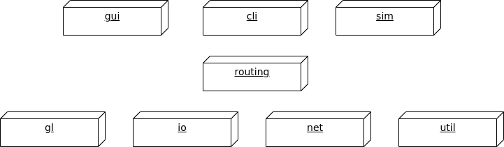

# Programmierung 3

Created by:
**Jonathan Neidel** (573619)

External sources are linked to in the referring function.

## Architecture

`gl`, `io`, `net` and `util` provide services for the above lying packages.
`routing` enables communication between the model of `gl` and the view-controllers of `gui` and `cli`.
`sim` also uses the same infrastructure.

**Main usage flow (CLI)**

- user types input into cli
- c: create event
- c: send event to server
- s: server receives event
- s: pass to event handler
- h: execute event
- h: evaluate return message
- s: send back response from handler
- c: receive response
- c: display results of the users action

## Upload examples

Following the schema of:
`MEDIA_TYPE PRODUCER ADDRESS SIZE TAGS BITRATE LENGTH [ENCODING HEIGHT WIDTH SAMPLING_RATE INTERACTION_TYPE LICENSE_HOLDER]`

Examples:
- `Audio prod song.aac 4000 News 320 30 AAC 44000`
- `AudioVideo prod movie.mp4 4000 Lifestyle 320 200 MP4 720 480 44000`
- `InteractiveVideo prod interactive_vid.mkv 8000 , 320 80 MKV 640 480 Performance`
- `LicensedAudio prod song.mp3 2000 , 320 800 MP3 44000 UMG`
- `LicensedAudioVideo prod music_video.mp4 16000 , 320 40 MP4 1080 720 44000 Warner`
- `LicensedVideo prod movie.mp4 700 Animal,Lifestyle 320 45 MP4 720 480 Warner`
- `Video prod film.mp4 4000 Animal 320 200 MP4 720 480`